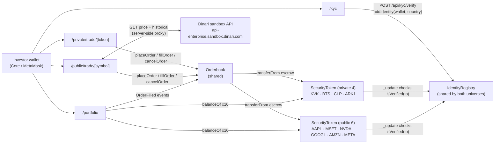

# Tessera

> Dual asset secondary market on Avalanche. Equity privado LatAm + equity
> público US bajo una sola identidad on-chain.

Tessera es una capa de mercado secundario sobre Avalanche Fuji que conecta
dos universos de activos con la misma verificación KYC:

- **Tessera Private** — equity privado latinoamericano (Kavak, Bitso, Clip,
  SPV de Arkangeles) emitido como SecurityTokens ERC-3643 propios, con
  orderbook y settlement on-chain.
- **Tessera Public (powered by Dinari)** — acciones públicas de EE.UU.
  (AAPL, MSFT, NVDA, GOOGL, AMZN, META) con precios + historicals + metadata
  servidos en vivo desde el sandbox real de Dinari, con secundario corriendo
  en nuestro mismo orderbook on-chain.

Construido para el [Hackathon LatAm Institucional de Avalanche](https://build.avax.network/events/8a8ee2e9-d91d-4087-adba-c1221b72e407)
(deadline 17 mayo 2026, 9:00 AM CDMX).

---

## El problema

LatAm tiene dos problemas de acceso al mercado, históricamente atacados por
soluciones distintas:

- **Equity privado atrapado** — ~2,400 startups en Series A–C sin liquidez
  secundaria. Empleados con stock options de Kavak o Bitso esperan 7–10
  años por una IPO que puede no llegar. Vender en SPV cuesta $50–200k USD
  en abogados y toma 3–6 meses.
- **Equity público inaccesible** — un inversionista mexicano que quiere
  exposure a AAPL típicamente paga ~1.5% en comisiones del broker
  tradicional, espera T+2 para settlement, no puede operar en bloques
  fraccionarios menores a una acción, y enfrenta fricción FX adicional.

Las soluciones existentes resuelven uno o el otro. Ninguna comparte capa de
identidad. El inversionista institucional típico abre **dos cuentas
distintas** y verifica KYC **dos veces**.

## La solución

Una sola capa de KYC on-chain abre ambos mundos:

1. **Verificas KYC una vez** vía `/kyc`. La address queda atestada en
   `IdentityRegistry.sol` por el claim issuer.
2. **Operas en `/private`** contra SecurityTokens de empresas privadas
   LatAm — el mismo orderbook valida tu KYC en `_update` de cada transfer
   (modelo ERC-3643).
3. **O operas en `/public`** contra mirrors on-chain de dShares de Dinari
   (AAPL, MSFT, …) — Tessera surfacea precios y charts reales de Dinari,
   el secundario corre sobre el mismo orderbook con las mismas reglas de
   compliance.

Demo end-to-end (≤2 min): conectar wallet → KYC → mintear USDC mock →
elegir Private o Public → ver precios live → colocar orden → verla en el
orderbook on-chain → portfolio refleja ambos universos.

---

## Live en Avalanche Fuji (chainId 43113)

### Núcleo

| Contrato            | Address                                                                                                                        |
| ------------------- | ------------------------------------------------------------------------------------------------------------------------------ |
| MockUSDC            | [`0xFaC00CC23F0b840A130A8Cb320d74FBBdcCf8dB6`](https://testnet.snowtrace.io/address/0xFaC00CC23F0b840A130A8Cb320d74FBBdcCf8dB6) |
| IdentityRegistry    | [`0x4d698C6f9e68C1cf6e3095e994114A44d8F6Ea96`](https://testnet.snowtrace.io/address/0x4d698C6f9e68C1cf6e3095e994114A44d8F6Ea96) |
| Orderbook           | [`0x830e07b0545461E279b0d24EB923937Ed4ECE042`](https://testnet.snowtrace.io/address/0x830e07b0545461E279b0d24EB923937Ed4ECE042) |

### Tessera Private (equity privado LatAm)

| Símbolo | Empresa             | Address                                                                                                                        |
| ------- | ------------------- | ------------------------------------------------------------------------------------------------------------------------------ |
| KVK     | Kavak Premium       | [`0x8d1933d5Dbb734f0D8CF47d7eC2E0dB4327F1B17`](https://testnet.snowtrace.io/address/0x8d1933d5Dbb734f0D8CF47d7eC2E0dB4327F1B17) |
| BTS     | Bitso               | [`0x3021d1739f1adE03BBC4b4208f8Ec3AEB04b3002`](https://testnet.snowtrace.io/address/0x3021d1739f1adE03BBC4b4208f8Ec3AEB04b3002) |
| CLP     | Clip                | [`0x09d0Ffe48526e7068aAd600626Bb3003feACEF13`](https://testnet.snowtrace.io/address/0x09d0Ffe48526e7068aAd600626Bb3003feACEF13) |
| ARK1    | Arkangeles SPV      | [`0xAC9BC752FF3D9DaA15e89bEBAE81D103D62F9c28`](https://testnet.snowtrace.io/address/0xAC9BC752FF3D9DaA15e89bEBAE81D103D62F9c28) |

### Tessera Public (mirror de dShares de Dinari)

| Símbolo | Empresa         | Address                                                                                                                        |
| ------- | --------------- | ------------------------------------------------------------------------------------------------------------------------------ |
| AAPL    | Apple Inc.      | [`0x17838Fe98B3039029AFA182c4b11a0057251a868`](https://testnet.snowtrace.io/address/0x17838Fe98B3039029AFA182c4b11a0057251a868) |
| MSFT    | Microsoft       | [`0xbCAE2BfC457c6fC927b7b557045aA1c45367Fb26`](https://testnet.snowtrace.io/address/0xbCAE2BfC457c6fC927b7b557045aA1c45367Fb26) |
| NVDA    | NVIDIA          | [`0x017756B9e291c3626853894eB7f693Ea0ECA1BA7`](https://testnet.snowtrace.io/address/0x017756B9e291c3626853894eB7f693Ea0ECA1BA7) |
| GOOGL   | Alphabet        | [`0xd7aEd6c9C4D0F0C16780E784a2B50287bC4D1B95`](https://testnet.snowtrace.io/address/0xd7aEd6c9C4D0F0C16780E784a2B50287bC4D1B95) |
| AMZN    | Amazon          | [`0x4d659989FD744D8a7927C54E901aC4547839084C`](https://testnet.snowtrace.io/address/0x4d659989FD744D8a7927C54E901aC4547839084C) |
| META    | Meta Platforms  | [`0x5dbb29BD3647a607F9Af771cEcDd9171f6Ec6b82`](https://testnet.snowtrace.io/address/0x5dbb29BD3647a607F9Af771cEcDd9171f6Ec6b82) |

48 órdenes activas en el orderbook al deploy (24 private + 24 public).
Las direcciones también viven en [`contracts/deployments/fuji.json`](./contracts/deployments/fuji.json)
en formato JSON tipado.

---

## Arquitectura



Tres capas, dos productos:

1. **Identity** (compartida) — `IdentityRegistry` con un `claimIssuer` que
   firma `addIdentity(wallet, country)`. **Una verificación abre ambos
   productos**. En producción el issuer sería un servicio KMS o un
   contrato multisig.
2. **Compliance** (per token) — `SecurityToken` (ERC-3643 simplificado)
   hereda ERC20 y sobrescribe `_update` para validar `isVerified(to)` y
   `block.timestamp >= lockupEnd` en toda transferencia entre direcciones
   reales. Los 10 tokens (4 private + 6 public) usan **el mismo registry**.
3. **Trading** (compartida) — `Orderbook` con escrow pull-style. Una sola
   instancia para los 10 tokens. Fee 0.3% en USDC, accumulado a `feesAccrued`.

La diferencia entre los dos productos vive sólo en la UI:

- **/private** usa `mockPriceSeries` + `useLastPrice` (lee el último
  `OrderFilled` del orderbook on-chain).
- **/public** usa `<DinariChart>` + `useDinariPrice` (lee Dinari sandbox vía
  `/api/dinari/*` proxy server-side, con cache de 30s para precios y 5 min
  para historicals).

---

## Stack técnico

**Smart contracts**
- Solidity 0.8.24 + OpenZeppelin v5 + Hardhat 2.28
- Sin partial fills, fee 0.3% al taker, escrow pull-style
- ABIs auto-exportados a `web/lib/abis/` vía `pnpm export-abis`

**Frontend**
- Next.js 14 (App Router) + TypeScript estricto + Tailwind v3.4
- shadcn/ui 2.10 (style new-york, base color neutral) + paleta custom
- wagmi v2 + viem v2 + RainbowKit v2 (Core + MetaMask + WalletConnect)
- TradingView `lightweight-charts` v5
- sonner para toasts, lucide-react para iconos

**Dinari sandbox integration**
- Server-only client en `web/lib/dinari-client.ts` (creds nunca tocan el
  bundle client)
- 3 routes proxy: `/api/dinari/stocks`, `/[id]/price`, `/[id]/history`
- `useDinariPrice` y `useDinariHistory` cachean vía React Query

---

## Tracks del hackathon

Tessera cubre los **tres tracks objetivo** con ambos productos:

| Track                                          | Cómo lo abordamos                                                                                                                                                                                              |
| ---------------------------------------------- | --------------------------------------------------------------------------------------------------------------------------------------------------------------------------------------------------------------- |
| **Mercados Secundarios para Equity Privado**   | Orderbook on-chain con escrow + fee 0.3%. Sin AMM. Patrón usado por BlackRock, Securitize y Tokeny.                                                                                                            |
| **Tokenización de Acciones IFC**               | 4 deals privados LatAm (Kavak, Bitso, Clip, Arkangeles SPV) + 6 mirrors públicos US (AAPL, MSFT, NVDA, GOOGL, AMZN, META) con datos reales de Dinari.                                                          |
| **Identidad Digital y KYC On-Chain**           | `IdentityRegistry` único que sirve a los 10 tokens. KYC reusable cross-universo es **el** value prop diferenciador. La misma wallet KYC-verificada puede tradear Kavak (privado) y AAPL (público) sin re-onboard. |

---

## Estructura del repositorio

```
tessera/                              (repo root — D:\AVAX)
├── README.md
├── CLAUDE.md                         project constraints
├── DEVELOPMENT_PLAN.md               original 7-phase plan
├── PITCH.md                          slide outline + demo script
├── PROMPT_DESIGN.md                  brief for the design redo
├── contracts/                        Hardhat
│   ├── contracts/
│   │   ├── IdentityRegistry.sol      shared KYC registry
│   │   ├── SecurityToken.sol         ERC-3643-style ERC20 (used 10x)
│   │   ├── MockUSDC.sol              6-dec stablecoin with public mint
│   │   └── Orderbook.sol             single shared escrow orderbook
│   ├── scripts/
│   │   ├── deploy.ts                 core + 4 private tokens
│   │   ├── deploy-public.ts          adds 6 Dinari mirror tokens, seeds 24 orders
│   │   ├── seed.ts                   24 orders for private side
│   │   ├── sync-env.ts               pushes all addresses to web/.env.local
│   │   └── export-abis.ts            ABIs -> web/lib/abis/
│   ├── test/                         8 specs, all passing
│   └── deployments/fuji.json
└── web/                              Next.js 14
    ├── app/
    │   ├── page.tsx                  landing — choose private or public
    │   ├── private/
    │   │   ├── page.tsx              private marketplace
    │   │   └── trade/[token]/page.tsx
    │   ├── public/
    │   │   ├── page.tsx              public marketplace (Dinari-powered)
    │   │   └── trade/[symbol]/page.tsx
    │   ├── portfolio/page.tsx        unified across both universes
    │   ├── kyc/page.tsx              3-step stepper
    │   ├── api/
    │   │   ├── kyc/verify/route.ts   signs addIdentity tx
    │   │   └── dinari/
    │   │       ├── stocks/route.ts            list
    │   │       ├── stocks/[id]/price/route.ts current quote
    │   │       └── stocks/[id]/history/route.ts historicals
    │   ├── providers.tsx             WagmiProvider + RainbowKit + ReactQuery
    │   └── layout.tsx
    ├── components/                   (presentation layer)
    └── lib/
        ├── dinari-client.ts          server-only Dinari API client
        ├── contracts.ts              typed addresses + ABIs
        ├── mock-companies.ts         private 4 + public 6 metadata
        └── ...
```

---

## Cómo correr local

Requisitos: Node 18+, pnpm 11+, wallet de Fuji con ~0.5 AVAX
(faucet en https://core.app/tools/testnet-faucet/), credenciales de Dinari
sandbox (gratis en https://partners.dinari.com).

```bash
# 1. Setup contracts + private deploy
cd contracts
pnpm install
cp .env.example .env       # pega tu PRIVATE_KEY de Fuji
npx hardhat compile
npx hardhat test           # 8 tests, todos pasan

pnpm deploy:fuji           # core + 4 private tokens (~0.0001 AVAX)
pnpm seed:fuji             # 24 orders en private side

# 2. Public side (Dinari mirrors)
pnpm deploy-public:fuji    # 6 public tokens + 24 orders

# 3. Push addresses to frontend
pnpm sync-env

# 4. Frontend
cd ../web
pnpm install
# añade DINARI_API_KEY_ID + DINARI_API_SECRET en .env.local
pnpm dev                   # http://localhost:3500
```

---

## Decisiones de diseño no triviales

1. **Una sola IdentityRegistry + un solo Orderbook para los 10 tokens.**
   No tiene sentido fragmentar la compliance — el value prop es justamente
   que el KYC es reusable cross-producto. En producción, una empresa que
   quiere ser su propio issuer puede deployar su propio SecurityToken
   apuntando al mismo registry y todos los usuarios verificados pueden
   operar instantáneamente.
2. **Public side = mirrors sintéticos en Fuji.** Dinari hoy deploya en
   Sepolia, Plume, Base, Arbitrum, Ethereum — no en Avalanche todavía.
   Para hackathon, replicamos sus tickers como nuestros propios
   SecurityTokens en Fuji para que el demo corra todo en una sola chain.
   Cuando Dinari ship a Avalanche, swap es trivial: cambiar las addresses
   en `web/lib/contracts.ts` por las suyas y borrar nuestros deploys.
3. **Dinari API server-only.** Las creds (`DINARI_API_KEY_ID`,
   `DINARI_API_SECRET`) jamás tocan el bundle del client. Las 3 routes
   `/api/dinari/*` proxy mantienen el sandbox aislado. Cache vía
   `next: { revalidate }` evita rate-limits.
4. **Charts del lado público son data real.** `<DinariChart>` llama al
   endpoint `historical_prices/?timespan=MONTH` que devuelve ~275 puntos
   diarios. No es mock — son los precios reales de AAPL, MSFT, etc.
5. **Orderbook ignora el universo.** Trade entre `SecurityToken` y USDC.
   Los 10 tokens son intercambiables para el contrato — la diferenciación
   private/public vive sólo en la UI. Esto deja la puerta abierta a
   features cross-product (ej. swaps Kavak ↔ AAPL en el futuro).
6. **Fee model único.** 0.3% al taker en USDC para ambos productos.
   `feesAccrued` único, withdrawable por owner.
7. **KYC issuer = deployer** en este demo. En producción reemplazaría con
   KMS o multisig por compliance.

---

## Roadmap (post-hackathon)

- [ ] **Migrar /public a Dinari real cuando shippeen Avalanche**. Las
      addresses sintéticas en `mock-companies.ts` se reemplazan por las
      reales — el orderbook ya está listo.
- [ ] **Partial fills** y matching off-chain con settlement on-chain
- [ ] **KYC real** vía Persona / SumSub / Onfido firmando claims off-chain
- [ ] **Tessera Funds** — wrappers ERC-4626 que indexan baskets cross-product
      (ej. "LatAm Top 10 + S&P 5")
- [ ] **L1 propia (Avalanche Subnet)** con eERC20 para privacy de holdings
- [ ] **ICM** para investors en otras L1
- [ ] **Indexer Subgraph** para que `useTradeHistory` no escanee `getLogs`
      cada bloque

---

## Equipo

- Daniel ([odiseo159@gmail.com](mailto:odiseo159@gmail.com)) — full stack +
  product
- Built en pair-programming con Claude Opus 4.7

## Demo

Video (YouTube unlisted): _pendiente, link aquí post-grabación_

## Licencia

MIT
