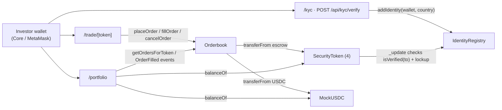

# EquityAccess

> El Nasdaq de las empresas privadas en LatAm. Inversionistas atrapados en
> rondas pueden salir en 60 segundos. Empresas dan liquidez a empleados sin
> tender offer caro.

Marketplace secundario para equity privado tokenizado en Avalanche con KYC
reusable on-chain y compliance integrado a nivel de smart contract.

Construido para el [Hackathon LatAm Institucional de Avalanche](https://build.avax.network/events/8a8ee2e9-d91d-4087-adba-c1221b72e407)
(deadline 17 mayo 2026, 9:00 AM CDMX).

---

## El problema

- En LatAm hay **~2,400 startups en Series A–C** sin liquidez secundaria.
- Inversionistas quedan **atrapados 7–10 años** entre la entrada y la salida.
- El proceso típico de venta de un secundario en SPV cuesta **$50k–$200k USD**
  en abogados y toma **3–6 meses**.
- Los empleados con stock options de Kavak, Bitso, Clip, etc. no pueden
  monetizarlas hasta una IPO/M&A que puede no llegar.

## La solución

EquityAccess es un orderbook on-chain en Avalanche Fuji donde:

1. **Inversionistas verificados** compran y venden fracciones tokenizadas de
   empresas privadas.
2. **El KYC se hace una vez**, queda atestado en `IdentityRegistry`, y todas
   las transferencias de tokens lo consultan.
3. **El compliance está dentro del token**, no en un contrato proxy. Cada
   `transfer` valida `IdentityRegistry.isVerified(to)` y respeta el lockup en
   `_update`. Modelo inspirado en ERC-3643.
4. **Las órdenes se ejecutan atómicamente** vía escrow en `Orderbook.sol`, con
   un fee del 0.3% sobre la pierna USDC que acumula al contrato.

Demo end-to-end (≤2 min): conectar wallet → KYC mock → ver marketplace →
entrar a vista de trading → colocar orden → verla aparecer en el orderbook →
ejecutarla → portfolio actualizado.

---

## Live en Avalanche Fuji (chainId 43113)

| Contrato            | Address                                                                                         |
| ------------------- | ----------------------------------------------------------------------------------------------- |
| MockUSDC            | [`0xFaC00CC23F0b840A130A8Cb320d74FBBdcCf8dB6`](https://testnet.snowtrace.io/address/0xFaC00CC23F0b840A130A8Cb320d74FBBdcCf8dB6) |
| IdentityRegistry    | [`0x4d698C6f9e68C1cf6e3095e994114A44d8F6Ea96`](https://testnet.snowtrace.io/address/0x4d698C6f9e68C1cf6e3095e994114A44d8F6Ea96) |
| Orderbook           | [`0x830e07b0545461E279b0d24EB923937Ed4ECE042`](https://testnet.snowtrace.io/address/0x830e07b0545461E279b0d24EB923937Ed4ECE042) |
| KVK Kavak Premium   | [`0x8d1933d5Dbb734f0D8CF47d7eC2E0dB4327F1B17`](https://testnet.snowtrace.io/address/0x8d1933d5Dbb734f0D8CF47d7eC2E0dB4327F1B17) |
| BTS Bitso           | [`0x3021d1739f1adE03BBC4b4208f8Ec3AEB04b3002`](https://testnet.snowtrace.io/address/0x3021d1739f1adE03BBC4b4208f8Ec3AEB04b3002) |
| CLP Clip            | [`0x09d0Ffe48526e7068aAd600626Bb3003feACEF13`](https://testnet.snowtrace.io/address/0x09d0Ffe48526e7068aAd600626Bb3003feACEF13) |
| ARK1 Arkangeles SPV | [`0xAC9BC752FF3D9DaA15e89bEBAE81D103D62F9c28`](https://testnet.snowtrace.io/address/0xAC9BC752FF3D9DaA15e89bEBAE81D103D62F9c28) |

Las direcciones también viven en [`contracts/deployments/fuji.json`](./contracts/deployments/fuji.json)
en formato JSON tipado (consumido por el frontend vía `web/lib/contracts.ts`).

---

## Arquitectura



Tres capas:

1. **Identity** — `IdentityRegistry` con un `claimIssuer` que firma
   `addIdentity(wallet, country)`. En el demo, el issuer es la misma wallet
   del deployer; en producción sería un servicio KMS o un contrato
   multisig.
2. **Compliance** — `SecurityToken` (ERC-3643 simplificado) hereda ERC20 y
   sobrescribe `_update` para que **toda** transferencia entre direcciones
   reales valide `isVerified(to)` y `block.timestamp >= lockupEnd`. Mint y
   burn (cuando `from == 0` o `to == 0`) bypassean estas reglas.
3. **Trading** — `Orderbook` con escrow pull-style: el maker deposita el
   activo (USDC para buy, tokens para sell) en `placeOrder`. `fillOrder`
   ejecuta atómicamente todo o nada y cobra 0.3% en USDC que se acumula a
   `feesAccrued`. `cancelOrder` regresa los fondos al maker.

---

## Stack técnico

**Smart contracts**
- Solidity 0.8.24 con `viaIR` desactivado y optimizer 200 runs
- OpenZeppelin v5 (ERC20, Ownable, SafeERC20)
- Hardhat 2.28 + `@nomicfoundation/hardhat-toolbox` 5
- ABIs auto-exportados a `web/lib/abis/` vía `pnpm export-abis`

**Frontend**
- Next.js 14 (App Router) + TypeScript estricto + Tailwind v3.4
- shadcn/ui v2 (style new-york, base color neutral) + custom EquityAccess
  palette en `globals.css` (`#F1EFE8` background, `#0F6E56` primary)
- wagmi v2 + viem v2 + RainbowKit v2 (Core wallet vía injected, MetaMask,
  WalletConnect)
- TradingView `lightweight-charts` v5 para el price chart
- sonner para toasts, lucide-react para iconos
- Hooks personalizados que auto-refetchean en cada bloque vía `useBlockNumber`
  + `queryClient.invalidateQueries`

**Workflow**
- pnpm 11 como package manager
- Monorepo simple: `contracts/` (Hardhat) + `web/` (Next.js) en la raíz
- `pnpm sync-env` lee `deployments/<network>.json` y pushea las addresses a
  `web/.env.local` preservando otras keys

---

## Tracks del hackathon

EquityAccess cubre los **tres tracks objetivo**:

| Track                                    | Cómo lo abordamos                                                                                                                                                                          |
| ---------------------------------------- | ------------------------------------------------------------------------------------------------------------------------------------------------------------------------------------------- |
| **Mercados Secundarios para Equity Privado** | Orderbook on-chain en lugar de AMM. Patrón usado por BlackRock, Securitize y Tokeny porque preserva price discovery y los reguladores lo aceptan.                                          |
| **Tokenización de Acciones IFC**         | Cada empresa = un `SecurityToken` ERC-20 con metadata pública (`companyName`, `sector`, `vintageRound`) y compliance enforced en `_update`. 4 deals reales tokenizados (Kavak, Bitso, Clip, Arkangeles SPV). |
| **Identidad Digital y KYC On-Chain**     | `IdentityRegistry` separado del token, con `claimIssuer` rotable. KYC reusable: una wallet verificada puede operar con cualquier `SecurityToken` que use el mismo registry.                |

---

## Estructura del repositorio

```
equity-access/
├── README.md                         (este archivo)
├── CLAUDE.md                         decisiones arquitectónicas y constraints
├── DEVELOPMENT_PLAN.md               plan en 7 fases con criterios de aceptación
├── PITCH.md                          slide outline + demo script de 2 min
├── contracts/                        Hardhat
│   ├── contracts/
│   │   ├── IdentityRegistry.sol      KYC registry, claimIssuer-gated
│   │   ├── SecurityToken.sol         ERC20 + compliance hook en _update
│   │   ├── MockUSDC.sol              ERC20 6 decimales, mint público
│   │   └── Orderbook.sol             escrow pull-style, fee 0.3% al taker
│   ├── scripts/
│   │   ├── deploy.ts                 deploya MockUSDC → Registry → 4 Tokens → Orderbook
│   │   ├── seed.ts                   24 órdenes (6 por token) desde el deployer
│   │   ├── sync-env.ts               pushea addresses a web/.env.local
│   │   └── export-abis.ts            extrae ABIs a web/lib/abis/
│   ├── test/                         8 specs (happy path + 1 error por contrato)
│   ├── deployments/fuji.json         live addresses on Fuji
│   ├── hardhat.config.ts
│   └── package.json
└── web/                              Next.js 14
    ├── app/
    │   ├── page.tsx                  marketplace (4 AssetCards + stats)
    │   ├── trade/[token]/page.tsx    trading view (header + chart + orderbook + panel)
    │   ├── portfolio/page.tsx        holdings + active orders + history
    │   ├── kyc/page.tsx              3-step stepper
    │   ├── api/kyc/verify/route.ts   server signs addIdentity con KYC_ISSUER_PRIVATE_KEY
    │   ├── providers.tsx             WagmiProvider + RainbowKit + ReactQuery
    │   └── layout.tsx
    ├── components/
    │   ├── ui/                       shadcn primitives
    │   ├── site-header.tsx           sticky topbar con KYC pill + ConnectButton
    │   ├── site-footer.tsx
    │   ├── asset-card.tsx
    │   ├── asset-price-cell.tsx      live last-price display
    │   ├── price-chart.tsx           lightweight-charts wrapper
    │   ├── orderbook.tsx             asks / spread / bids con depth bars
    │   ├── trade-panel.tsx           buy / sell tabs con fee live + state machine
    │   ├── trade-grid.tsx            client wrapper que comparte prefill state
    │   ├── kyc-stepper.tsx
    │   ├── portfolio-{holdings,orders,history}.tsx
    ├── hooks/
    │   ├── use-kyc-status.ts         IdentityRegistry.isVerified
    │   ├── use-last-price.ts         último OrderFilled o midprice mock
    │   ├── use-orders.ts             orderbook completo + groupOrderbook helper
    │   ├── use-place-order.ts        approve + placeOrder con sonner + parseError
    │   ├── use-cancel-order.ts
    │   ├── use-mint-usdc.ts          self-serve faucet
    │   ├── use-user-balances.ts      USDC + 4 token balances
    │   ├── use-user-orders.ts        active orders del user
    │   └── use-trade-history.ts      OrderFilled event scan + getOrder cross-ref
    └── lib/
        ├── abis/                     auto-generado por export-abis.ts
        ├── contracts.ts              typed addresses + contractsReady flag
        ├── mock-companies.ts         metadata + midprices de las 4 empresas
        ├── mock-orderbook.ts         fallback orders + 30d price walk
        ├── format.ts                 Intl.NumberFormat helpers
        ├── parse-error.ts            viem error → mensaje en español
        ├── utils.ts                  cn() de shadcn
        └── wagmi.ts                  getDefaultConfig con avalancheFuji
```

---

## Cómo correr local

Requisitos: Node 18+, pnpm 11+, una wallet de Avalanche Fuji con 0.5 AVAX
mínimo (faucet en https://core.app/tools/testnet-faucet/).

```bash
# 1. Setup contracts
cd contracts
pnpm install
cp .env.example .env       # pega tu PRIVATE_KEY de Fuji
npx hardhat compile
npx hardhat test           # 8 tests deben pasar

# 2. Deploy + seed (30s)
pnpm deploy:fuji           # deploya y graba deployments/fuji.json
pnpm sync-env              # copia addresses a web/.env.local
pnpm seed:fuji             # mintea 1M USDC y coloca 24 órdenes

# 3. Frontend
cd ../web
pnpm install
pnpm dev                   # http://localhost:3500
```

---

## Decisiones de diseño no triviales

1. **Orderbook on-chain, no AMM.** Es el patrón correcto para securities
   (BlackRock, Securitize, Tokeny). Un AMM diluye price discovery y los
   reguladores lo odian.
2. **Compliance dentro del token.** Cada `transfer` valida con
   `IdentityRegistry.isVerified(to)`. Sin proxy de compliance separado, sin
   forwarder, sin module registry.
3. **Fee solo al taker** en USDC, acumulado en `feesAccrued`. Maker recibe
   exactamente lo que pidió. Withdrawable por el owner via
   `withdrawFees(recipient)`.
4. **`feesAccrued` se trackea explícito** en lugar de usar
   `usdc.balanceOf(this)`, porque el balance también incluye USDC escrowed
   de buy orders activas.
5. **El orderbook se auto-verifica** en el registry en deploy.ts. Sin esto
   los SecurityTokens no podrían entrar al escrow.
6. **No hay partial fills.** El spec dice "ejecuta el trade" (singular).
   Para partial, el usuario hace varias órdenes pequeñas. Simplifica el
   contrato ~50 líneas.
7. **KYC issuer = deployer** en este demo. `KYC_ISSUER_PRIVATE_KEY` en
   `web/.env.local` es la misma `PRIVATE_KEY` de `contracts/.env`. Producción
   reemplazaría con KMS o multisig.
8. **El frontend funciona sin contratos.** `contractsReady` flag + mock data
   en `mock-orderbook.ts` permiten desarrollar la UI antes del deploy. Apenas
   los addresses entran al `.env.local`, todo se enchufa solo.

---

## Roadmap (post-hackathon)

- [ ] **Partial fills** y batched matching off-chain con settlement on-chain
- [ ] **KYC real** vía Persona / SumSub / Onfido firmando claims off-chain que
      el `IdentityRegistry` valida con ECDSA
- [ ] **Multi-issuer**: cada empresa puede ser el issuer de su propio
      `SecurityToken` con su propio lockup y reglas de compliance
- [ ] **Bridge a USDC real** (CCIP / Wormhole) para volumen institucional
- [ ] **L1 propia (Avalanche Subnet)** con eERC20 (encrypted ERC-20) para
      privacy de holdings — ya hay PoC de Avalanche
- [ ] **ICM** para que un investor en una L1 distinta opere sin moverse de chain
- [ ] **Indexer Subgraph** para que `useTradeHistory` no escanee `getLogs`
      cada bloque
- [ ] **Tender offers programáticas** que la empresa ejecuta con un solo tx
      contra todos los holders elegibles

---

## Equipo

- Daniel ([odiseo159@gmail.com](mailto:odiseo159@gmail.com)) — full stack +
  product
- Built en pair-programming con Claude Opus 4.7

## Demo

Video (YouTube unlisted): _pendiente, link aquí post-grabación_

## Licencia

MIT
